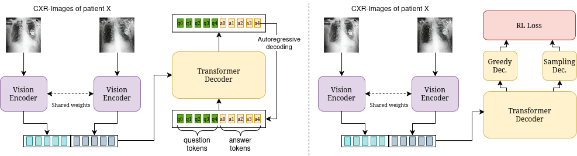

# SwinVED-SCST — Official Code Repository

This repository contains the **official implementation** of the first model baseline of the paper:

📄 **Paper:** *MIMIC-CXR-VQA: A Medical Visual Question Answering Dataset Constructed with LLaMA-based Annotations*


🔗 **Link:** [Comming Soon!!]

-----

## Model Architecture

Below is the architecture diagram used in the baseline:



-----

## Dataset

This work is built upon the **MIMIC-CXR-VQA** dataset:
🔗 **Link:** [Comming Soon!!]

📂 Directory Structure and Contents

To ensure the parsing script functions correctly, please download the dataset and set up the following directory structure within the /data folder (an example structure is provided in /data):

    Images: Place the 4555 PNG images inside: /data/padchestgr/PadChest_GR/

    CSV Files (Annotations): Place the following two CSV files inside: /data/padchestgr/

        train_final_separated.csv (containing 7342 entries for training)

        test_final_separated.csv (containing 2121 entries for testing)

Each entry (row) in the CSV files corresponds to a single finding for a study.

-----

## 1\. Environment Setup 🐍

Create and activate the conda environment:

```bash
conda env create -f environment.yml
conda activate swinbed
```

-----


## 2\. Running Experiments 🚀

## 2. Running Experiments 🚀

### Base Training Pipeline

To execute the full training pipeline, follow these sequential steps:

1.  **Change Directory:** First, navigate to the training directory:
    ```bash
    cd train
    ```

2.  **Experiment 1: NLL Training (Frozen Encoder)**
    Execute the initial Negative Log-Likelihood (NLL) training run with the model's encoder frozen:
    ```bash
    ./nll_train_freeze_econder.sh
    ```

3.  **Experiment 2: NLL Training (Unfrozen Encoder)**
    Follow up with the NLL training using an unfrozen encoder for full model fine-tuning:
    ```bash
    ./nll_train_unfreeze_econder.sh
    ```

4.  **Experiment 3: Reinforcement Learning (RL) Training**
    Complete the process by executing the Reinforcement Learning (RL) training phase:
    ```bash
    ./rl_train.sh
    ```